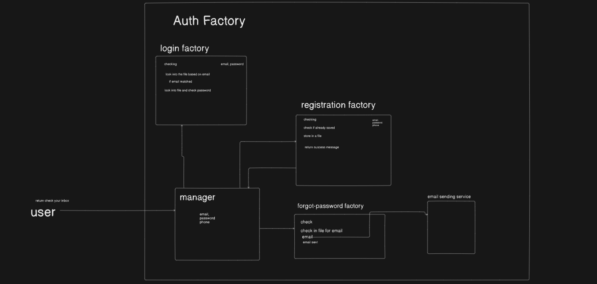

# **Day 1 – Introduction to JavaScript**

- Started with a real-world analogy (furniture factory) to simplify programming concepts and to relate how programming/web development works.
- Explored an Auth Factory to see how it works at a high level.
- Learned why we need JavaScript and programming languages in general.
- Took a quick look of history and evolution of JavaScript.
- Learned function syntax, created mini factory functions to practice it.
- Got a solid overview of functions and their importance in JavaScript.
  

  
  

