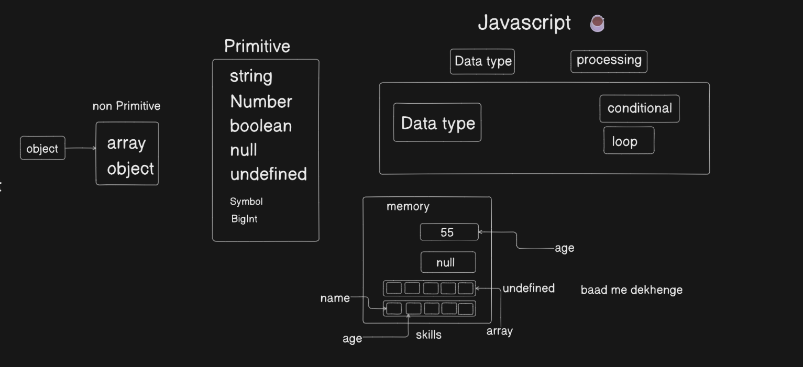

# **JavaScript DataTypes, Conditionals & Loops**

- Hitesh sir started the class with why you should learn in iteration, it's importance and how it helps in building programming fundamentals.
- Data Types & Processing
- Why we need Data Processing
- Different Types of Data Types
- Types of Processing
  1. Conditionals
  2. Loops
- Learn about let and const.
- Practice conditionals & Loops by solving some basic problems to build fundamentals.

  
  

